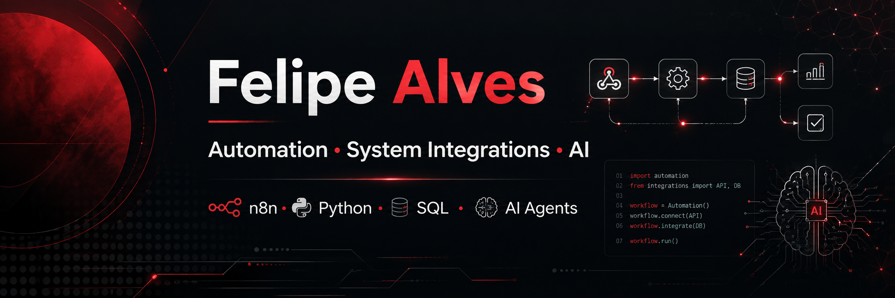

  

### Automation Analyst | System Integrations | AI Automation

---

## 👨‍💻 About Me

I'm an **Automation Analyst** focused on building solutions that connect systems, automate processes and use Artificial Intelligence to improve workflows.

Currently working with:

- ⚙️ Workflow Automation
- 🔗 System Integrations
- 🤖 n8n
- 🐍 Python
- 🗄️ SQL / SQL Server
- 🌐 REST APIs & Webhooks
- 🧠 AI Agents
- ✨ AI-powered Workflows

I'm currently studying **Software Engineering** and expanding my knowledge in **Quality Engineering, Test Automation and AI/LLM Quality**.

---

## 🛠️ Tech Stack

### ⚙️ Automation & Integrations

### 💻 Programming

### 🗄️ Data

### 🧠 Artificial Intelligence

### 🔧 Tools

---

## 🎯 Current Focus

<pre>
QA Fundamentals
      ↓
Test Automation
      ↓
Quality Engineering
      ↓
AI / LLM Quality
      ↓
AI Quality Engineering
</pre>

My current learning path combines **software quality, automation and Artificial Intelligence**, using programming as a foundation for building automated tests, integrations and AI quality solutions.

---

## 🚀 Featured Project

### 💰 WalletUp

Personal finance management application developed with the support of Artificial Intelligence.

---

## ⚡ Recent GitHub Activity

<!--START_SECTION:activity-->
- No recent public activity yet.
<!--END_SECTION:activity-->

---

## 🐍 Contribution Activity

---

## 📫 Contact

